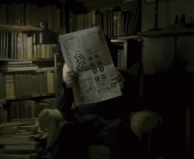

# Gamma_News

# Gamma News

## Introducción ##

Vas a crear un ciberperiódico, con imágenes dinámicas, y una distribución ol'style.

Dispones de un archivo en formato markdown y una imágen dinámica para cada noticia dentro de cada carpeta del repositorio.

## Requisitos ##

- HTML

- CSS

    - Formateo de texto

    - Display

    - GRID

#### ¡Mira [este ejemplo](https://codepen.io/silkine/full/QWBxVX) para inspirarte!

## Iteraciones ##

1. Poner todas las noticias e imágenes en el documento HTML.

    Has de poner todo el contenido que va a tener tu periódico, para así fijar todo el contenido y no tener sorpresas después. Especial atención a la semántica.

2. Aplicar estilos al texto.

    Pon una fuente personalizada, interlineado y demás estilos al texto.

3. Añadimos las columnas.

    Incluimos las columnas, el espaciado entre columnas y texto, y todo lo relacionado con la distribucion general.

4. Ajustamos márgenes, bordes y rellenos.

    Esto comprende toques finales, en los que se aprovechan las herramientas de márgenes y rellenos a la hora de espaciar los contenidos, además de separaciones estéticas como los bordes.
